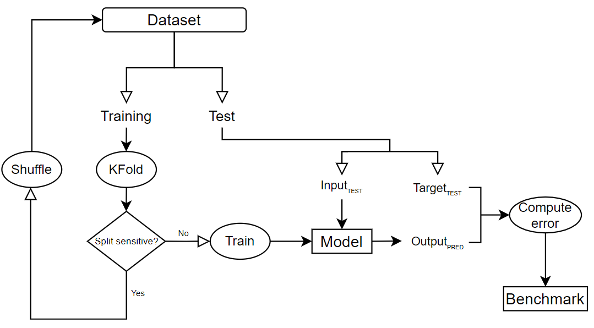

# Forecasting competition
Project for Smart Distribution Systems course at KU Leuven, Belguim. 

The goal of this assignment is to design a neural network (or a set of neural
networks) to forecast the Belpex wholesale electricity price. 
The dates of these 3 days are not given but one is provided with relevant data
of the 7 preceding days in each case. The final objective is to produce a forecast
that has the smallest Mean Square Error (MSE) possible compared to the real prices
of the 3 days.

## Content
- ``main`` calls functions from the other files in a structured way
- ``data_manager`` develops all the functions to process, correct and standarize the solar, wind and price data
- ``neural_network`` develops a function with the Neural Network architecture design, as well as training and testing

## Structure
- ``/data`` contains all the .csv files provided for the assignment commitment
- ``/model`` contains the models created by the Neural Network function. Each model is stored within a unique folder (format: model_date_hour_error) containing its configuration
- ``/images`` includes outcomes and information with graphical representation 
- ``/report`` report pdf storage

## Methodology
Training and validation is done as explained in the flowchart

## Report
The report explain how (and why) the authors selected final features and architecture 
as well as include the figures and/or tables that were deem relevant.
It will be available [here](documentation/report.pdf).

## Authors
[Alberte Bouso ](mailto:alberte.bousogarcia@student.kuleuven.be)

[Román Cantú ](mailto:roman.canturodriguez@student.kuleuven.be)
